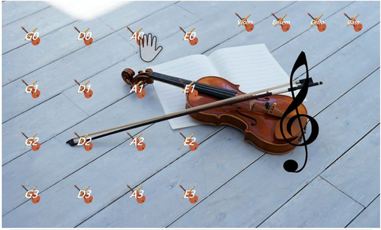

# Kinect Violin

A Windows desktop application that lets you play a virtual violin using **Kinect v2** body tracking, custom hand-hover buttons, and **MIDI** output.

The project extends the [Kinect v2 WPF Custom Button](https://github.com/dehariapankaj/WPFKinectV2CustomButton) demo pattern: buttons respond to hand pointer enter/leave events instead of mouse clicks. Combined with Visual Gesture Builder (VGB) gesture detection, hovering over a string/fret button and performing a bowing gesture sends MIDI notes to a virtual instrument.



*The virtual violin UI: hover a hand over note buttons (G/D/A/E strings) to select pitch, choose an instrument at the top right, then perform a bowing gesture to play via MIDI.*

## What It Does

1. **Hand-hover UI** — 16 fret buttons (G/D/A/E strings) and 4 instrument selectors (Violin, Ensemble, Cello, Bass) inside a `KinectRegion`.
2. **Gesture recognition** — Detects the custom `PlayString` bowing gesture from a VGB database (`.gba` files in `Database/`).
3. **MIDI output** — Sends `ProgramChange`, `NoteOn`, and `NoteOff` messages via [RtMidi.Core](https://www.nuget.org/packages/RtMidi.Core) to the first available MIDI output device.
4. **Body visualization** — Draws tracked skeleton joints in the UI (`KinectBodyView`).

### Typical Interaction Flow

```
Hover hand over a string button → Select instrument → Perform bowing gesture → MIDI note plays
```

## Requirements

### Hardware

| Item | Notes |
|------|-------|
| **Kinect for Windows v2** | Sensor + power hub + USB 3.0 port |
| **Windows PC** | 64-bit Windows 10/11 recommended |
| **MIDI output device** | e.g. [loopMIDI](https://www.tobias-erichsen.de/software/loopmidi.html) or a DAW virtual port |

### Software

| Item | Version |
|------|---------|
| **.NET Framework** | 4.7.2 |
| **Visual Studio** | 2019 or 2022 (with .NET desktop development workload) |
| **Kinect for Windows SDK** | 2.0 (v2.0_1409) — **required for runtime** |

> **Important:** Kinect managed DLLs in this project are **x86 (32-bit)**. Always build with the **x86** platform. Building as x64 will cause a `BadImageFormatException` at startup.

## Dependencies

### NuGet Packages (restored automatically)

| Package | Version | Purpose |
|---------|---------|---------|
| [Microsoft.Kinect.VisualGestureBuilder](https://www.nuget.org/packages/Microsoft.Kinect.VisualGestureBuilder) | 2.0.1410.19000 | Custom gesture recognition |
| [RtMidi.Core](https://www.nuget.org/packages/RtMidi.Core) | 1.0.50 | MIDI output |
| [Newtonsoft.Json](https://www.nuget.org/packages/Newtonsoft.Json) | 12.0.3 | JSON serialization (referenced, lightly used) |
| [Serilog](https://www.nuget.org/packages/Serilog) | 2.8.0 | Logging (referenced, lightly used) |

### Bundled References (`Kinect_Violin/References/`)

| DLL | Purpose |
|-----|---------|
| `Microsoft.Kinect.dll` | Kinect body tracking API |
| `Microsoft.Kinect.Wpf.Controls.dll` | `KinectRegion`, hand pointer controls |

### External Downloads (install manually)

| Software | Download |
|----------|----------|
| **Kinect for Windows SDK 2.0** | [Microsoft Download Center](https://www.microsoft.com/en-us/download/details.aspx?id=44561) |
| **loopMIDI** (optional, for sound) | [tobias-erichsen.de/software/loopmidi.html](https://www.tobias-erichsen.de/software/loopmidi.html) |
| **NuGet CLI** (if `nuget restore` is needed) | [dist.nuget.org/win-x86-commandline/latest/nuget.exe](https://dist.nuget.org/win-x86-commandline/latest/nuget.exe) |

Install the Kinect SDK **before** running the app, with the sensor **unplugged**. Plug in the Kinect after installation completes.

## Getting Started

### 1. Clone the repository

```powershell
git clone https://github.com/markkuo1999/Kinect-V2-Virtual-Violin.git
cd Kinect-V2-Virtual-Violin/Kinect_Violin
```

### 2. Restore NuGet packages

If the `packages/` folder is missing:

```powershell
# Download nuget.exe to the project folder if you don't have it
Invoke-WebRequest -Uri "https://dist.nuget.org/win-x86-commandline/latest/nuget.exe" -OutFile "nuget.exe"

.\nuget.exe restore WpfKinectV2CustomButton.sln
```

### 3. Install Kinect SDK 2.0

Download and run `KinectSDK-v2.0_1409-Setup.exe` from the [Microsoft Download Center](https://www.microsoft.com/en-us/download/details.aspx?id=44561).

### 4. Build (x86 only)

**Command line:**

```powershell
& "C:\Program Files\Microsoft Visual Studio\2022\Community\MSBuild\Current\Bin\MSBuild.exe" WpfKinectV2CustomButton.sln /p:Configuration=Debug /p:Platform=x86
```

Adjust the MSBuild path if you use a different Visual Studio edition.

**Visual Studio:**

1. Open `Kinect_Violin/WpfKinectV2CustomButton.sln`
2. Set configuration to **Debug | x86**
3. Build → Build Solution (`Ctrl+Shift+B`)

### 5. Run

```powershell
.\bin\x86\Debug\WpfKinectV2CustomButton.exe
```

Or press **F5** in Visual Studio with **Debug | x86** selected.

## Project Structure

```
Kinect_Violin/
├── App.xaml / App.xaml.cs          # Application entry point
├── MainWindow.xaml / .cs           # Main UI, Kinect init, MIDI, button logic
├── KinectV2CustomButton.cs         # Custom Kinect-aware button control
├── KinectV2CustomButtonController.cs  # Hand pointer enter/leave detection
├── GestureDetector.cs              # VGB gesture detection per body
├── GestureResultView.cs            # Gesture state + MIDI trigger logic
├── KinectBodyView.cs               # Skeleton rendering
├── Database/                       # VGB gesture databases (.gba, .gbd)
├── Images/                         # UI assets (violin icons, backgrounds)
├── References/                     # Kinect SDK managed DLLs
└── packages/                       # NuGet packages (after restore)
```

## Button Layout

### String / Fret Buttons (16)

| String | Buttons | MIDI Keys |
|--------|---------|-----------|
| G | G0–G3 | 55–60 |
| D | D0–D3 | 62–67 |
| A | A0–A3 | 69–74 |
| E | E0–E3 | 76–81 |

### Instrument Selectors (4)

| Button | MIDI Program | Pitch Offset |
|--------|--------------|--------------|
| Violin | 40 | 0 |
| Ensem | 49 | 0 |
| Cello | 42 | −20 |
| Bass | 43 | −32 |

## Troubleshooting

| Problem | Solution |
|---------|----------|
| `BadImageFormatException` on startup | Build with **x86**, not x64 or Any CPU |
| `VisualGestureBuilder` not found | Run `nuget restore`; ensure `packages/` exists |
| App crashes when window loads | Ensure `Images/` is copied to output (handled by post-build step) |
| No sound | Install loopMIDI; route MIDI to a synth or DAW |
| Kinect not detected | Install Kinect SDK 2.0; use USB 3.0; check Device Manager for "KinectSensor Device" |
| Gesture not recognized | Stand in sensor range; ensure `Database/PlayString.gba` is present in output folder |

## License

This project is based on Microsoft Kinect SDK sample patterns. Refer to the [Kinect for Windows SDK 2.0 license terms](https://www.microsoft.com/en-us/download/details.aspx?id=44561) for SDK usage.
